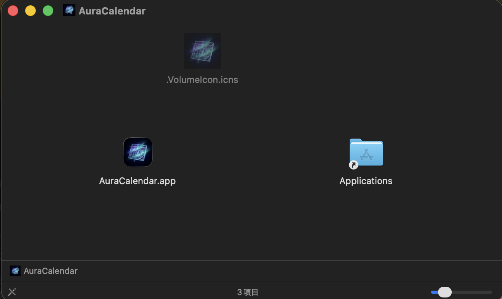

# AuraCalendar


macOS のメニューバーに次の予定をシンプルに表示するアプリです。
Google カレンダーなどの iCal URL を登録するだけで、複雑な認証なしに予定をサッと確認できます。

[使い方ガイドはこちら](docs/guide.md)

---

## ✨ 機能

- **メニューバー表示** — 次の予定タイトルと開始までの残り時間をメニューバーに常駐表示
- **ステルスモード** — アイコンを左クリックするだけで予定の表示・非表示を瞬時に切り替え（背後に人が来ても安心）
- **複数カレンダー対応** — 複数の iCal URL を登録し、最も直近の予定を自動選択
- **繰り返し予定対応** — RRULE / EXDATE を解釈し、定例会議なども正しく表示
- **GUI 設定画面** — トレイを右クリック → `Preferences...` から設定を変更可能（JSONの直接編集不要）
- **表示フォーマット自由設定** — `{minutes_until}` や `{title}` などのプレースホルダーで表示内容をカスタマイズ

## 📸 スクリーンショット


---

## 🚀 インストール方法

### 方法1：DMGファイルからインストール

1.  [Releases ページ](https://github.com/naoya25/aura-calendar/releases) へ
2.  `dmg`ファイルをダウンロード
3.  ダウンロードした`dmg`ファイルをダブルクリックして起動
4.  `AuraCalendar.app`を`Application`にドラッグ&ドロップ
    

5.  `AuraCalendar.app`を起動
    「"AuraCalendar.app"は壊れているため開けません...」という警告が出ます

6.  terminalを開き以下のコマンドを実行

    ```bash
    xattr -cr /Applications/AuraCalendar.app
    ```

7.  もう一度`AuraCalendar.app`を開く

### 方法2：ソースコードからビルド

ご自身の環境でビルドすることで、Gatekeeperの警告を完全に回避できます。

**必要な環境**

- [Rust](https://www.rust-lang.org/tools/install) (stable)
- Node.js (npm / npx)
- Xcode Command Line Tools

```bash
# リポジトリをクローン
git clone [https://github.com/naoya25/aura-calendar.git](https://github.com/naoya25/aura-calendar.git)
cd aura-calendar

# アプリをビルド（初回はコンパイルに時間がかかります）
npx tauri build
```

ビルド完了後、`src-tauri/target/release/bundle/dmg/` または `macos/` 内に生成されたアプリをご利用ください。

---

## 📖 使い方

1. アプリを起動すると、メニューバーにアイコンが表示されます。
2. アイコンを **右クリック → Preferences...** を開き、カレンダーの iCal URL を登録します。
   _(※ iCal URL は Google カレンダーの「設定 → カレンダーの統合 → 非公開の iCal 形式の URL」から取得できます)_
3. **左クリック** で予定の表示・非表示を切り替えられます（ステルスモード）。
4. 終了する場合は **右クリック → Quit AuraCalendar** を選択します。

---

## ⚙️ 設定

設定は GUI から変更できますが、実体は以下のパスに保存されます。

```text
~/Library/Application Support/AuraCalendar/config.json
```

**設定項目**

| キー                       | 説明                             | デフォルト                    |
| -------------------------- | -------------------------------- | ----------------------------- |
| `calendars`                | カレンダー名と iCal URL のリスト | `[]`                          |
| `display.normal_format`    | 通常時の表示フォーマット         | `{minutes_until}分後 {title}` |
| `display.stealth_format`   | ステルス時の表示文字列           | `***`                         |
| `display.show_title`       | 予定タイトルを表示するか         | `true`                        |
| `refresh_interval_seconds` | 情報更新の間隔（秒、最小30）     | `300`                         |

**フォーマットのプレースホルダー**

| プレースホルダー  | 内容                         |
| ----------------- | ---------------------------- |
| `{minutes_until}` | 開始までの残り時間（合計分） |
| `{hh}`            | 時間部分                     |
| `{mm}`            | 分部分（2桁）                |
| `{title}`         | 予定のタイトル               |

---

## 💻 開発情報

### 動作環境

- macOS 12 Monterey 以降 (Apple Silicon / Intel 両対応)

### 技術スタック

- **[Tauri 2](https://tauri.app/)** — クロスプラットフォームデスクトップフレームワーク
- **[Rust](https://www.rust-lang.org/)** — バックエンド全般
- **HTML / CSS / JavaScript** — 設定画面 UI

### 開発コマンド

```bash
# 開発モードで起動
npx tauri dev

# テスト
cargo test

# フォーマット・Lint
cargo fmt --all
cargo clippy --all-targets --all-features -- -D warnings
```

※ Pull Request および `main` への push 時には、GitHub Actions により `fmt`, `clippy`, `test` が自動実行されます。

---

## 📄 ライセンス

[MIT License](LICENSE)
