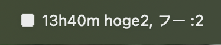
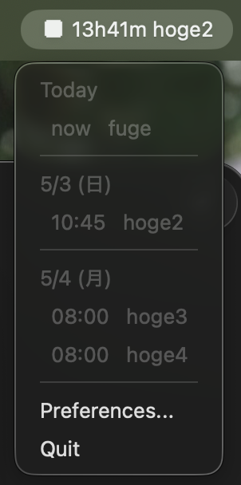
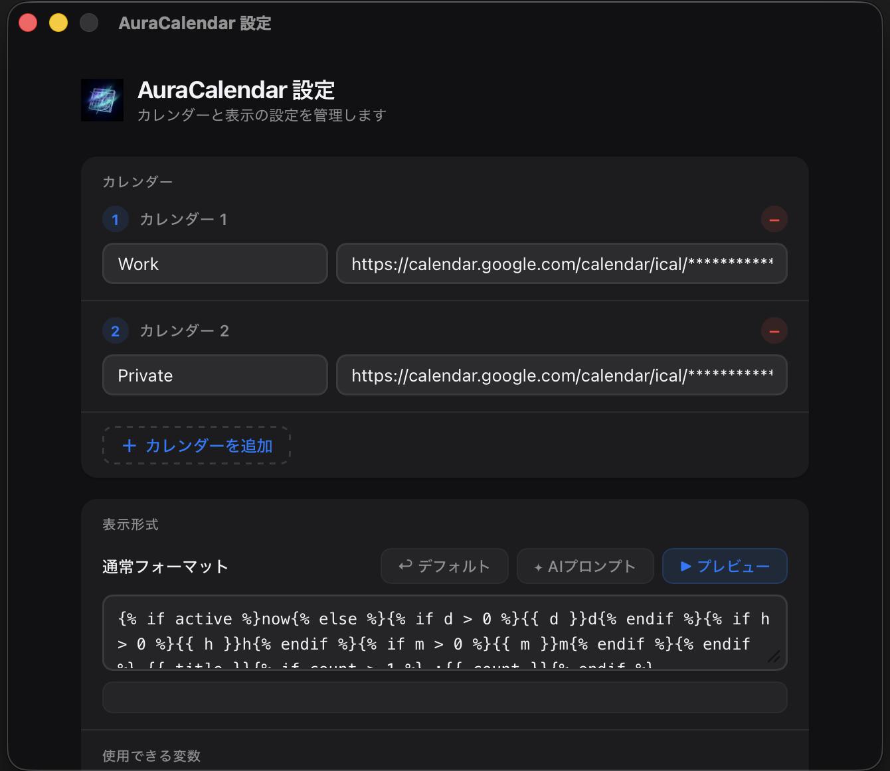
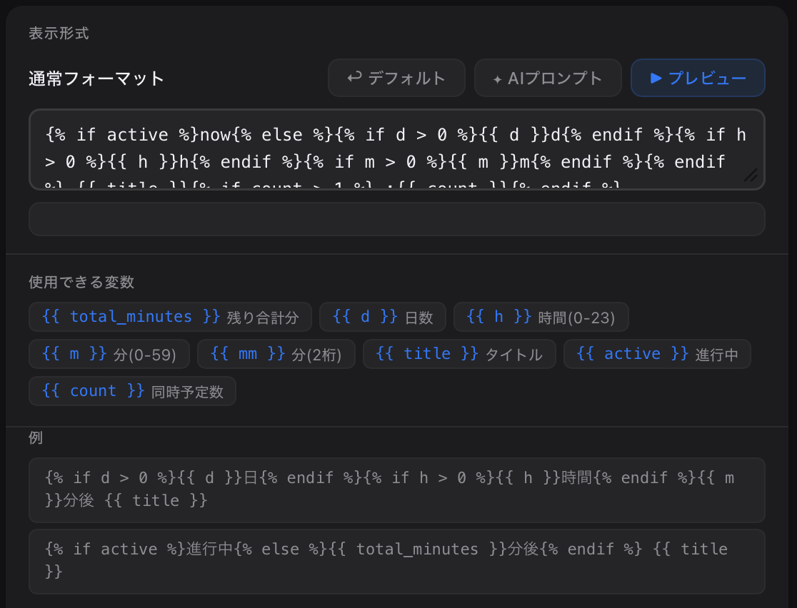

# AuraCalendar 使い方ガイド

次の予定をメニューバーにずっと表示する macOS アプリです。Google カレンダーなどの URL を登録するだけで使えます。

---

## メニューバーに予定が表示される



アプリを起動すると、メニューバーに **次の予定の残り時間とタイトル** が常時表示されます。

表示例：`13h40m hoge2, フー :2`
- `13h40m` → 次の予定が始まるまでの時間
- `hoge2, フー` → 予定のタイトル
  - `{title1}, {title2}, ...` このように表示されます
- `:2` → 同じ時間に予定が 2 件あることを示す

---

## クリックで直近の予定一覧を確認する



メニューバーのアイコンをクリックすると、**今日から3日分の予定一覧**がメニューとして表示されます。

- **Today** — 現在進行中の予定は `now` と表示
- **5/3 (日)** のように日付ごとに区切られ、時刻と予定名が並ぶ
- `Preferences...` → 設定画面を開く
- `Quit` → アプリを終了する

---

## はじめての設定

### 1. 設定画面を開く

メニューバーをクリックして **Preferences...** を選択します。



### 2. iCal URL を登録する

**「＋ カレンダーを追加」** をクリックし、カレンダーの名前と iCal URL を入力します。

複数のカレンダーを登録でき、最も近い予定が自動的にメニューバーに表示されます。

#### Google カレンダーの iCal URL の取得方法

1. [Google カレンダー](https://calendar.google.com) を開く
2. 左側のカレンダー名の横にある「︙」→「**設定と共有**」をクリック
3. 画面下部の「**カレンダーの統合**」セクションにある「**非公開の iCal 形式の URL**」をコピー

> ⚠️ **非公開 URL** を使ってください。この URL を他人に教えると予定が見られます。

### 3. 保存する

設定画面右下の **「保存」** ボタンをクリックすると設定が反映されます。

---

## 表示フォーマットをカスタマイズする



メニューバーに表示される文字列は **Jinja2 テンプレート** で自由に変更できます。

### テンプレートの例

**シンプルに「X分後 タイトル」と表示**
```
{{ total_minutes }}分後 {{ title }}
```

**日・時間・分を組み合わせて表示**
```
{{ d }}日{{ h }}時間{{ m }}分後 {{ title }}
```

**進行中かどうかで切り替える**
```
進行中{{ total_minutes }}分後 {{ title }}
```

### AIに書いてもらう

テンプレートの書き方がよくわからない場合は、「**✦ AIプロンプト**」ボタンをクリックしてください。ChatGPT や Claude などの AI チャットに貼り付けられるプロンプトがコピーされます。「〇〇のように表示してほしい」と伝えるだけでテンプレートを作ってもらえます。

### プレビューで確認する

**「▶ プレビュー」** ボタンをクリックすると、実際の予定データでどのように表示されるか確認できます。問題があるとエラーが表示されます。

---

## ステルスモード

画面の共有中や人目が気になるときに予定を隠せます。

設定画面の **「ステルス切替キー」** でショートカットキーを登録しておくと、キー一発で表示を切り替えられます（デフォルト: `⌃A`）。

ステルス中は設定した文字列（デフォルト: `***`）がメニューバーに表示されます。

---

## 更新間隔の設定

| 設定項目 | 説明 | デフォルト |
|----------|------|------------|
| カレンダー取得間隔 | インターネットからデータを取得する頻度 | 300秒（5分） |
| 表示更新間隔 | 残り時間の表示を更新する頻度 | 30秒 |

カレンダー取得は最短 30 秒、表示更新は最短 5 秒に設定できます。

---

## よくある質問

**Q: 予定が表示されない**
- iCal URL が正しいか確認してください（Google カレンダーの「非公開」URL を使用しているか）
- 設定画面で「保存」ボタンを押しましたか？

**Q: 予定が更新されない**
- カレンダー取得間隔の時間が経過すると自動更新されます
- 設定を保存し直すと即時更新されます

**Q: メニューバーに文字が長すぎて表示が崩れる**
- 表示フォーマットを短くするか、タイトルを表示しない設定（「タイトルを表示」をオフ）にしてください
